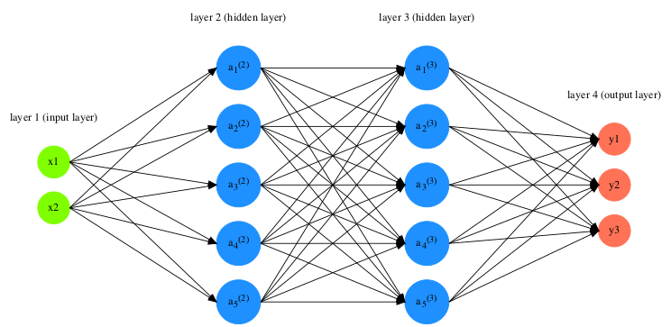
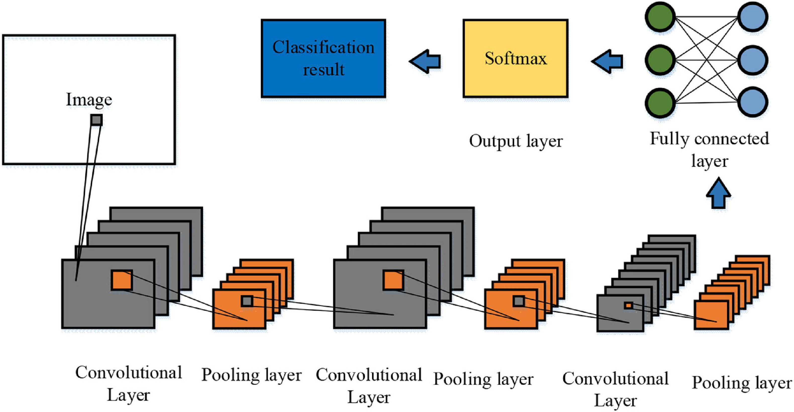

# NeuralNets
A project on teaching Deep Neural Networks to Rationalize with LIME Feedback

Most Neural Networks in use today  are black boxes that are hard to interpret due to their complex nature and high dimensionality. 
Interpretability of these Machine Learning Models helps human decision-makers understand how these models rationalize their behavior 
and verify the predictions ultimately building trust and improving safety, especially in high-stakes applications like medicine to diagnose patients. 
Through this study, we show how the black-box nature of these Neural Nets obscures us from the underlying spurious correlations they 
sometimes tend to make between the features that might not align with human reasoning and still manage to deliver predictions with high accuracy. 
This can be a problem when sensitive variables are involved and misclassifications can have catastrophic consequences. 
To that end, we evaluate a classifier designed using a standard Neural Network architecture with LIME.

